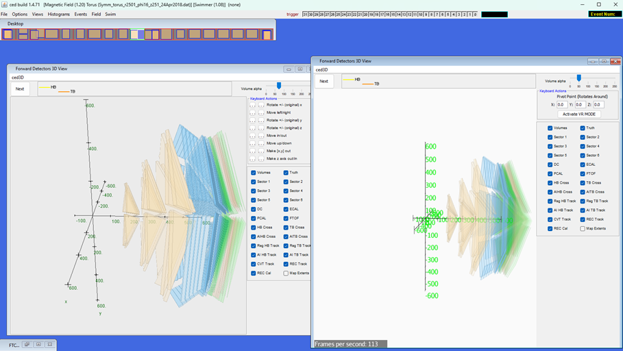
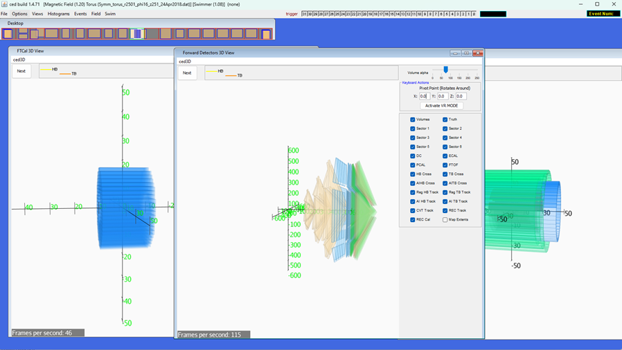

Here is some information for the JMonkey3D display that could be useful. My name is Hunter Frields, and I worked on this project for the majority of my junior year. You can contact me at [hfrields@gmail.com](mailto:hfrields@gmail.com) if you have any questions. The code that I wrote for this project was sometimes clean, and sometimes rough, and you will have to parse through it but I will give you a rundown of how I constructed it.

For starters, every class I modified is in the bCNU3D package. I also added a few lines to the ced runnable to add the displays to the window, which, assuming Heddle updated the ced window, will have to take it and add it to his current ced package. I am providing the entire bCNU3D folder and the ced folder for simplicity. The vast majority of the classes I copied and changed from OPENGL to JMonkey3D interactions have class names ending in Imp2. For example, the original version is in the ced folder in the package directory cnuphys.ced.ced3d/KeyboardLegend.java. I copied that class and went through it to make it compatible with JMonkey3D, and that directory is in the bCNU3D folder in the package detector.items. It was not as easy as just switching references. JMonkey3D works by adding items to a scene only when it is initialized, but the implementation Heddle used revolved around the idea that everything was created and drawn to the screen every frame. I had to adjust a lot of the base 3D classes and make secondary implementations to account for this. This is also important to keep in mind because one of the major issues that remain in this program revolves around this difference. I also went ahead and added to-dos near most of the issues listed below that you can search for.

1. (Has a TO-DO) In MainDisplay.java, the switching of the display is handled. What I mean by that is that in order to have multiple 3D displays simultaneously inside of the ced main desktop, I had to come up with a custom solution. JMonkey3D does not allow multiple 3D instances in one program, so instead, I switch contexts. When a 3D window is focused in the ced main desktop, the JMonkey3D window is displayed in that 3D window and it only displays the items associated with that 3D window. The other 3D window (the one that lost focus) loses the 3D display, but to maintain visual of what you were looking at, it saves a screenshot of the last known 3D display and puts that in the frame instead. So, the result is simultaneous 3D displays, but only the display in focus updates and there is about a 200 ms delay between switching windows. The ced folder has a folder called ScreenShots which saves the screenshots of the unfocused display windows.
    1. The issue is that for some reason, the JMonkey3D panel seems to want to scale based on the Windows Display Scale in System -> Display -> Scale. That is an issue because if someone has 200% desktop scale, the window would be oversized and only ¼ of the screen would actually be visible. I made a to-do on the width and height that needs to be adjusted in accordance with windows scaling.
2. (No TO-DO) Another issue is that because the JMonkey3D is its own 3D display, it runs on a separate thread than the main software. In my junior year, I was less aware of the risks of deadlocking with multithreading. You will have to debug the code because, while infrequent, the code seems to deadlock sometimes on boot. That means that somewhere I am not making sure the setup is done in-order.
3. (HAS A TO-DO) In KeyboardLegendImp2.java, I created a custom legend for the 3D displays. I also added the VR button to this legend. Currently it is not set to do anything, which is not the intended behavior. I never got to implement the VR behavior. JMonkey3D offers built-in vr support, you will need to access the main JMonkey3D display and initiate its vr mode, and you will most likely need to adjust the camera. I created a “Chase” camera that is default because a chase camera allows you to rotate the camera about a point, which made the most sense for a 3D graph. A “Free” camera would make more sense for VR mode.
4. (No TO-DO) I never added an on-window-resize for the canvas. I noticed that if a window loses focus and regains focus, the code segment around issue 1 does rescale the window in accordance with the window-resize, however, it looks as though I never rescale the window on-window-resize, which should be associated with the JPanel that houses the window. In the on-window-resize, the JMonkey3D canvas should be scaled properly to fit the JPanel.
5. (No TO-DO) TrajectoryDrawer3DImp2.Java handles the drawing of the trajectory paths of particles through the detector. The original version was called TrajectoryDrawer3D in package cnuphys.ced.ced3d in the ced folder. As mentioned earlier, the original method of drawing assumed that objects were drawn and created every single frame, but since JMonkey3D relies on adding objects and then drawing them separately, there is an issue in converting from one format to the other. My solution, which only works sometimes, was to only create new objects if the particle paths changed, but for some reason, this did not always work, and I never got to figure out how to deal with it. The particle detector itself never changed, so this was not an issue with the particle detector, but the simulated particles do change based on what simulation is ran. Technically there is the option of deleting all trajectory objects from the scene objects in the JMonkey3D frame at the beginning of the part where it reads in the trajectories from a list and then add them all again from the list, but that is non-optimal and may majorly impact performance. The most optimal solution is to just make some on-change function that is only called when new trajectories are loaded or changed, but at the time, I was unaware of all the different buttons or selections that could change the trajectories.
6. There might be other issues I never caught, but the above issues are the major ones I discovered around the time I stopped working on the project. You can contact me if you find any other issues and need help tracking their origins, or if I did not provide all custom-written code. You should be able to run ced and see the displays and they should be fully interactable with the current code. You might need to spend some time getting all the required packages from Heddle and adjusting your imports and etc, but it should look like this image when you are on the right screen:

  
  
Original Display (Left), New Display (Right)

  &nbsp;&nbsp;&nbsp;&nbsp;

  
  
All 3 Displays on One Screen

Extra Note:

- The other displays are black until you actually focus them and let the computer save those screenshots. Also, if you load in new trajectories, it will not update on the non-focused displays until they are focused on.
- You will have to download the JMonkey3D library and include it in the project.
